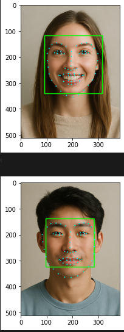
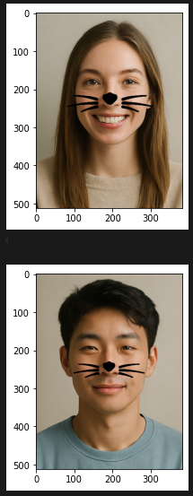
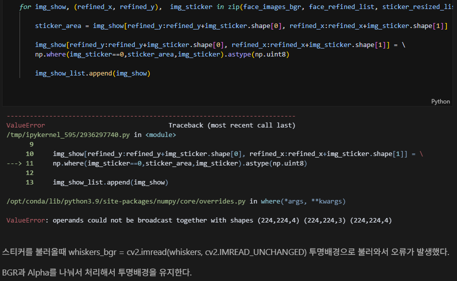
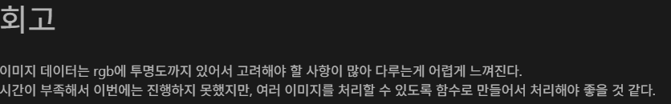
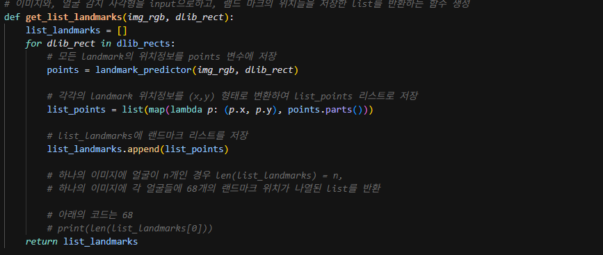

# AIFFEL Campus Online Code Peer Review Templete
- 코더 : 박수연
- 리뷰어 : 임한결


# PRT(Peer Review Template)
- [x]  **1. 주어진 문제를 해결하는 완성된 코드가 제출되었나요?**
    - 문제에서 요구하는 최종 결과물이 첨부되었는지 확인
        - 중요! 해당 조건을 만족하는 부분을 캡쳐해 근거로 첨부

    .
    
    사람 이미지에서 얼굴 부분을 잘 감지하고, landmark를 잘 검출하는 모습입니다.

    
    사용자가 원하는 스티커를 성공적으로 얼굴에 붙인 모습입니다.
    
- [x]  **2. 전체 코드에서 가장 핵심적이거나 가장 복잡하고 이해하기 어려운 부분에 작성된 
주석 또는 doc string을 보고 해당 코드가 잘 이해되었나요?**
    - 해당 코드 블럭을 왜 핵심적이라고 생각하는지 확인
    - 해당 코드 블럭에 doc string/annotation이 달려 있는지 확인
    - 해당 코드의 기능, 존재 이유, 작동 원리 등을 기술했는지 확인
    - 주석을 보고 코드 이해가 잘 되었는지 확인
        - 중요! 잘 작성되었다고 생각되는 부분을 캡쳐해 근거로 첨부
    
    
    이미지에서 색상 채널과 알파 채널을 분리하여, 이미지 영역을 blending하는 코드.
    여러 주석들을 활용해 코드를 설명하고, 여러 input 상황을 고려하여 
    문제없이 코드가 동작하도록 잘 작성한 부분입니다. 
    
        
- [x]  **3. 에러가 난 부분을 디버깅하여 문제를 해결한 기록을 남겼거나
새로운 시도 또는 추가 실험을 수행해봤나요?**
    - 문제 원인 및 해결 과정을 잘 기록하였는지 확인
    - 프로젝트 평가 기준에 더해 추가적으로 수행한 나만의 시도, 
    실험이 기록되어 있는지 확인
        - 중요! 잘 작성되었다고 생각되는 부분을 캡쳐해 근거로 첨부
    
    이미지와 스티커의 shape error가 발생한 것을 확인하고, 에러의 발생 원인과 해결 방법을 상세히 기록하였습니다.
        
- [x]  **4. 회고를 잘 작성했나요?**
    - 주어진 문제를 해결하는 완성된 코드 내지 프로젝트 결과물에 대해
    배운점과 아쉬운점, 느낀점 등이 기록되어 있는지 확인
    - 전체 코드 실행 플로우를 그래프로 그려서 이해를 돕고 있는지 확인
        - 중요! 잘 작성되었다고 생각되는 부분을 캡쳐해 근거로 첨부
    
    회고를 통해 프로젝트 중 어려웠던 점, 느낀 점 등을 잘 기술하였습니다.
        
- [x]  **5. 코드가 간결하고 효율적인가요?**
    - 파이썬 스타일 가이드 (PEP8) 를 준수하였는지 확인
    - 코드 중복을 최소화하고 범용적으로 사용할 수 있도록 함수화/모듈화했는지 확인
        - 중요! 잘 작성되었다고 생각되는 부분을 캡쳐해 근거로 첨부
    
    여러 개의 이미지를 한 번에 처리하기 쉽도록 landmark를 검출하는 기능을 함수화하여
    코드가 깔끔하고 매끄럽게 작동되도록 만든 모습입니다.

# 회고(참고 링크 및 코드 개선)
```
# 리뷰어의 회고를 작성합니다.
# 코드 리뷰 시 참고한 링크가 있다면 링크와 간략한 설명을 첨부합니다.
# 코드 리뷰를 통해 개선한 코드가 있다면 코드와 간략한 설명을 첨부합니다.

이미지를 불러올 때, 투명배경을 포함해 여러 방식으로 불러올 수 있다는 사실을 처음 알게 되었고,
그 때마다 각 방식에 맞추어 데이터를 적절하게 처리해주어야 하는 방법을 알게 되었던 의미있는 코드 리뷰였습니다.
이외에도 이미지 데이터를 잘 다루고, 적절한 함수화와 예외처리, 시각화 방식과 에러를 해결하는 방식까지
코드가 전반적으로 깔끔하고 설명이 자세해서 좋았습니다. 

```
