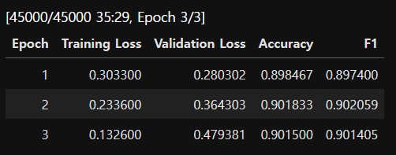
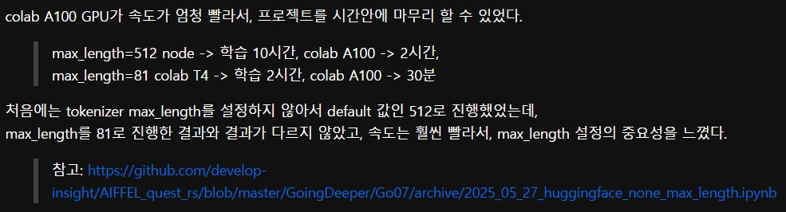
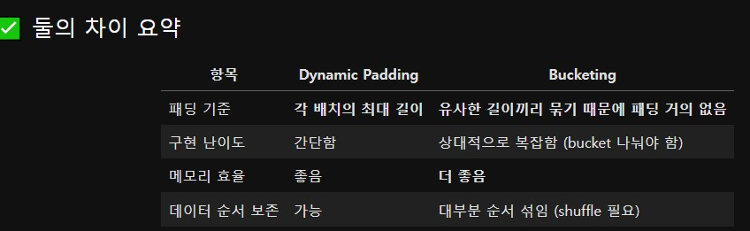

# AIFFEL Campus Online Code Peer Review Templete
- 코더 : 박수연
- 리뷰어 : 김범모

# PRT(Peer Review Template)
- [X]  **1. 주어진 문제를 해결하는 완성된 코드가 제출되었나요?**

        - base라인 모델 학습

        - Bucketing 적용 모델 학습
[!image2.jpg](image2.jpg)

        - test 데이터에 대한 성능이 90% 이상입니다.
[!image3.jpg](image3.jpg)
    
- [X]  **2. 전체 코드에서 가장 핵심적이거나 가장 복잡하고 이해하기 어려운 부분에 작성된 
주석 또는 doc string을 보고 해당 코드가 잘 이해되었나요?**
[image4.jpg](image4.jpg)

        - mrpc와 같은 이중분류 문제여서 glue의 mrpc metric을 로드해서 사용했습니다.
[!image5.jpg](image5.jpg)

        - Trainer를 사용하여 학습을 진행했고, 진행과정을 표로 확인하였습니다.
        
- [X]  **3. 에러가 난 부분을 디버깅하여 문제를 해결한 기록을 남겼거나
새로운 시도 또는 추가 실험을 수행해봤나요?**

        - 학습 시간이 10시간으로 너무 오래 걸렸지만 max_length를 지정해서 학습시간을 2시간으로 단축시켰습니다.

        
- [X]  **4. 회고를 잘 작성했나요?**

        - Dynamic Padding과 Bucketing의 차이점을 정리하였고 실험결과도 정리되어있었습니다.
        
- [X]  **5. 코드가 간결하고 효율적인가요?**

        - 네, 전체적으로 코드가 간결하고 효율적이었습니다.

# 회고(참고 링크 및 코드 개선)
다양한 실험을 많이 진행하셨고 그에 따른 결과도 마크다운으로 잘 정리해주셔서 배울 점이 많았습니다!
